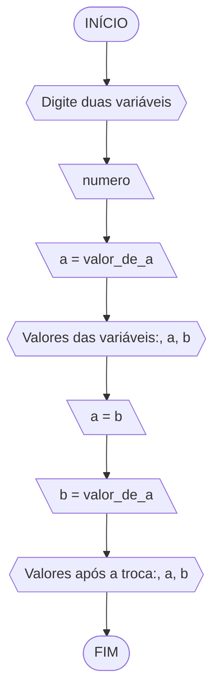
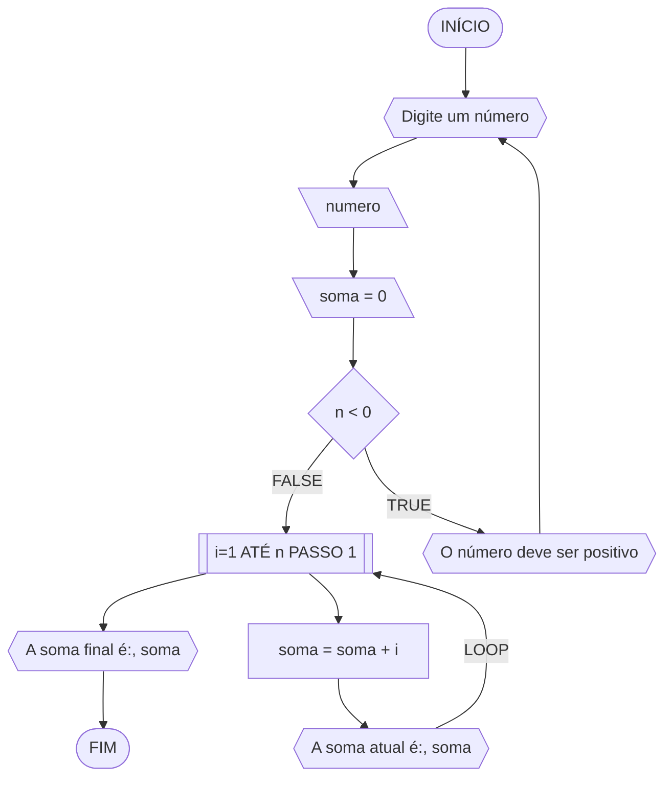

**Curso:** Ciência da Computação <br>
**Disciplina:** Raciocínio Lógico Algorítmico <br>
**Código/Turma:** T160-40 <br>
**Professor:** Ricardo Carubbi <br>
**Data:** 20/03/2024 <br>
**Aluno(a):** Lucas Carreiro Gomes <br>
**Matrícula:** 2417144 <br>

**1a chamada (Sim/Não):** Sim <br>
**2a chamada (Sim/Não):** Não

# Avaliação Diagnóstica 1

### Questão 01 - Troca dos valores de duas variáveis

#### Pseudocódigo
```
ALGORITMO
DECLARE a,b: real
INÍCIO
a = valor_de_a
ESCREVA "Digite duas variáveis"
LEIA a,b
ESCREVA "Valores das variáveis:", a, b
a = b
b = valor_de_a
ESCREVA "Valores após a troca:", a, b
FIM_ALGORITMO
```
#### Fluxograma

#### Teste de mesa
| a | b | valor_de_a | a | b |
| -- | -- | -- | -- | -- |
| 7 | 2 | 7 | 2 | 7 |
| 8 | 1 | 8 | 1 | 8 |
| 6 | 4 | 6 | 4 | 6 |

### Questão 02 - Contagem

#### Pseudocódigo
```
ALGORITMO
DECLARE nota: REAL, cont, n: INTEIRO
INÍCIO
cont == 0
ESCREVA "Digite um conjunto de notas"
LEIA n
SE nota > 100 ou nota < 0
  REPITA
  ESCREVA "Apenas notas entre 0 e 100 são válidas"
  ATE_QUE n <= 100 e n >= 0
SENÃO
  PARA i de 1 ATÉ n FAÇA
    SE nota >= 50
      cont == cont + 1
    SENÃO
      cont == cont
  FIM_PARA
  ESCREVA "A quantidade de aprovados é:", cont
FIM_ALGORITMO
```
#### Fluxograma

#### Teste de mesa
| it | n | nota | nota >= 50 | cont |
| -- | -- | -- | -- | -- |
| 1 | 10 | 90 | V | 1 |
| 2 | 10 | 78 | V | 2 |
| 3 | 10 | 85 | V | 3 |
| 4 | 10 | 45 | F | 3 |
| 5 | 10 | 92 | V | 4 |
| 6 | 10 | 82 | V | 5 |
| 7 | 10 | 40 | F | 5 |
| 8 | 10 | 88 | V | 6 |
| 9 | 10 | 35 | F | 6 |
| 10 | 10 | 65 | V | 7 |

### Questão 03 - Soma de um conjunto de números

#### Pseudocódigo
```
ALGORITMO
DECLARE n, rep: inteiro, i, soma: real
INÍCIO
ESCREVA "Digite um número positivo"
LEIA n
soma == 0
SE n < 0
  REPITA
  ESCREVA "O número deve ser positivo"
  ATE_QUE n >= 0
SENÃO
  PARA i de 1 ATÉ n PASSO 1 FAÇA
    soma == soma + i
    ESCREVA "A soma atual é:", soma
  FIM_PARA
  ESCREVA "A soma final é:",
FIM_ALGORITMO
```
#### FLUXOGRAMA

#### Teste de mesa
| it | n | soma | i | soma = soma + i |
| -- | -- | -- | -- | -- |
| 1 | 5 | 0 | 1 | 1 |
| 2 | 5 | 1 | 2 | 3 |
| 3 | 5 | 3 | 3 | 6 |
| 4 | 5 | 6 | 4 | 10 |
| 5 | 5 | 10 | 5 | 15 |

### Questão 04 - Cálculo fatorial

#### Pseudocódigo
```
ALGORITMO
DECLARE n, fatorial: inteiro
INÍCIO
ESCREVA "Digite um número positivo"
LEIA n
SE n < 0
  REPITA
  ESCREVA "O número deve ser positivo"
  ATE_QUE n >= 0
SENAO
