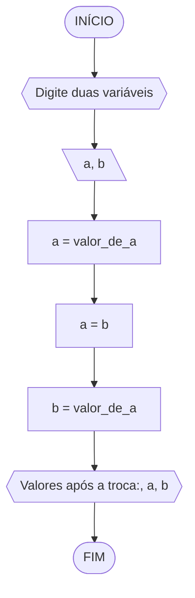
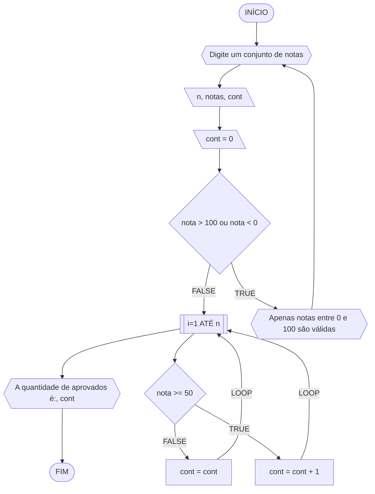
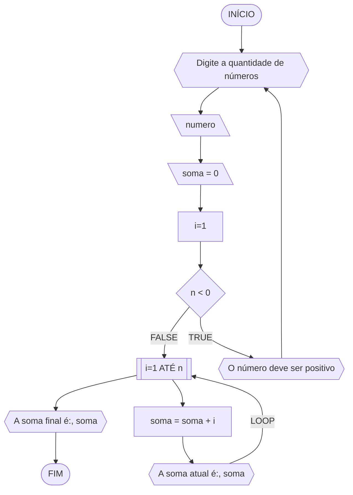
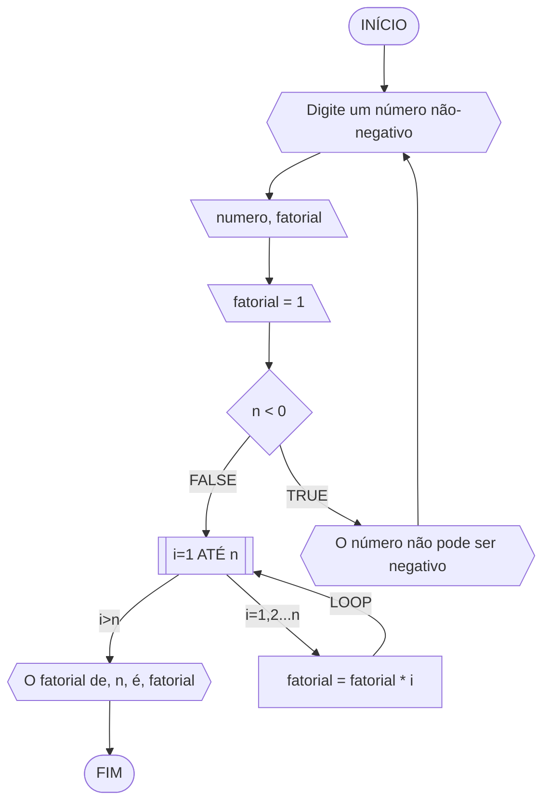
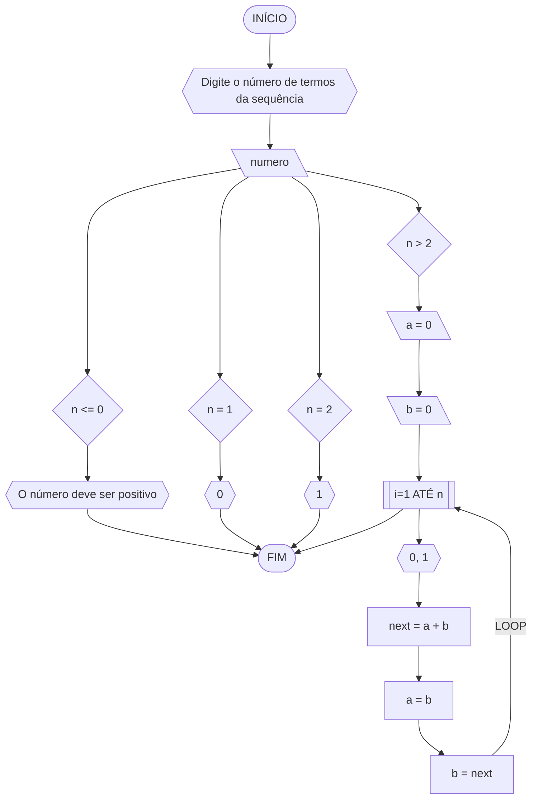
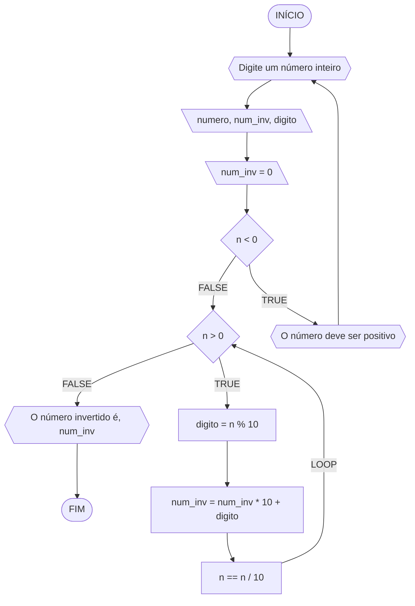

**Curso:** Ciência da Computação <br>
**Disciplina:** Raciocínio Lógico Algorítmico <br>
**Código/Turma:** T160-40 <br>
**Professor:** Ricardo Carubbi <br>
**Data:** 20/03/2024 <br>
**Aluno(a):** Lucas Carreiro Gomes <br>
**Matrícula:** 2417144 <br>

**1a chamada (Sim/Não):** Sim <br>
**2a chamada (Sim/Não):** Não

# Avaliação Diagnóstica 1

### Questão 01 - Troca dos valores de duas variáveis

#### Pseudocódigo
```
ALGORITMO
DECLARE a,b: REAL
INÍCIO
a = valor_de_a
ESCREVA "Digite duas variáveis"
LEIA a,b
ESCREVA "Valores das variáveis:", a, b
a = b
b = valor_de_a
ESCREVA "Valores após a troca:", a, b
FIM_ALGORITMO
```
#### Fluxograma

#### Teste de mesa
| a | b | valor_de_a | a | b | Saída |
| -- | -- | -- | -- | -- | -- |
| 7 | 2 | 7 | 2 | 7 | 2, 7 |

### Questão 02 - Contagem

#### Pseudocódigo
```
ALGORITMO
DECLARE nota: REAL, cont, n: INTEIRO
INÍCIO
cont == 0
ESCREVA "Digite um conjunto de notas"
LEIA n
SE nota > 100 ou nota < 0
  REPITA
  ESCREVA "Apenas notas entre 0 e 100 são válidas"
  ATE_QUE n <= 100 e n >= 0
SENÃO
  PARA i de 1 ATÉ n FAÇA
    SE nota >= 50
      cont == cont + 1
    SENÃO
      cont == cont
  FIM_PARA
  ESCREVA "A quantidade de aprovados é:", cont
FIM_ALGORITMO
```
#### Fluxograma

#### Teste de mesa
| it | n | nota | nota >= 50 | cont | aprovados |
| -- | -- | -- | -- | -- | -- |
| 1 | 10 | 90 | V | 1 |  |
| 2 | 10 | 78 | V | 2 |  |
| 3 | 10 | 85 | V | 3 |  |
| 4 | 10 | 45 | F | 3 |  |
| 5 | 10 | 92 | V | 4 |  |
| 6 | 10 | 82 | V | 5 |  |
| 7 | 10 | 40 | F | 5 |  |
| 8 | 10 | 88 | V | 6 |  |
| 9 | 10 | 35 | F | 6 |  |
| 10 | 10 | 65 | V | 7 |  |

### Questão 03 - Soma de um conjunto de números

#### Pseudocódigo
```
ALGORITMO
DECLARE n, rep: INTEIRO, i, soma: REAL
INÍCIO
ESCREVA "Digite um número não-negativo"
LEIA n
soma == 0
SE n < 0
  REPITA
  ESCREVA "O número deve ser positivo"
  ATE_QUE n >= 0
SENÃO
  PARA i de 1 ATÉ n PASSO 1 FAÇA
    soma == soma + i
    ESCREVA "A soma atual é:", soma
  FIM_PARA
  ESCREVA "A soma final é:",
FIM_ALGORITMO
```
#### FLUXOGRAMA

#### Teste de mesa
| it | n | soma | i | soma = soma + i |
| -- | -- | -- | -- | -- |
| 1 | 5 | 0 | 1 | 1 |
| 2 | 5 | 1 | 2 | 3 |
| 3 | 5 | 3 | 3 | 6 |
| 4 | 5 | 6 | 4 | 10 |
| 5 | 5 | 10 | 5 | 15 |

### Questão 05 - Cálculo fatorial

#### Pseudocódigo
```
ALGORITMO
DECLARE n, fatorial: INTEIRO
INÍCIO
ESCREVA "Digite um número não-negativo"
LEIA n
fatorial == 1
SE n < 0
  REPITA
  ESCREVA "O número deve ser positivo"
  ATE_QUE n >= 0
SENAO
  PARA i de 1 ATÉ n FAÇA
  fatorial = fatorial * i
  FIM_PARA
  ESCREVA "O fatorial de", n, "é", fatorial
FIM_ALGORITMO
```
#### Fluxograma

#### Teste de mesa
| it | n | i | fatorial |
| -- | -- | -- | -- |
| 1 | 5 | 1 | 1 |
| 2 | 5 | 2 | 2 |
| 3 | 5 | 3 | 6 |
| 4 | 5 | 4 | 24 |
| 5 | 5 | 5 | 120 |

### Questão 6 - Geração da sequência de Fibonacci

#### Pseudocódigo
```
ALGORITMO
DECLARE a, b, n, next: INTEIRO
INÍCIO
ESCREVA "Digite o número de termos da sequência"
LEIA n
ESCOLHA
  CASO n <= 0
    ESCREVA "O número deve ser positivo"
  CASO n = 1
    ESCREVA "0"
  CASO n = 2
    ESCREVA "0, 1"
  CASO n > 2
    a == 0
    b == 1
    PARA i de 3 ATÉ n FAÇA
      ESCREVA "0, 1"
      next = a + b
      ESCREVA next
      a = b
      b = next
    FIM_PARA
FIM_ESCOLHA
FIM_ALGORITMO
```
#### Fluxograma

#### Teste de mesa
| it | n  | a  | b  | i  | saída | next | a = b | b = next |
| -- | -- | -- | -- | -- | -- | -- | -- | -- |
| 1  | 5  | 0  | 1  | 1  | 0 | 0 + 1 = 1 | 1 | 1 |
| 2  | 5  | 1  | 1  | 2  | 1 | 1 + 1 = 2 | 1 | 2 |
| 3  | 5  | 1  | 2  | 3  | 1 | 1 + 2 = 3 | 2 | 3 |
| 4  | 5  | 2  | 3  | 4  | 2 | 2 + 3 = 5 | 3 | 5 |
| 4  | 5  | 3  | 5  | 5  | 3 | 3 + 5 = 8 | 5 | 8 |

### Questão 7 - Inversão dos dígitos de um número inteiro

#### Pseudocódigo
```
ALGORITMO
DECLARE n, num_inv, digito: INTEIRO
INÍCIO
ESCREVA "Digite um número positivo"
LEIA n
num_inv == 0
SE n < 0
  ESCREVA "O número deve ser positivo"
SENAO
  ENQUANTO n > 0
    digito == n % 10
    num_inv == num_inv * 10 + digito
    n == n / 10
  FIM_ENQUANTO
  ESCREVA "O número invertido é:", num_inv
FIM_ALGORITMO
```
#### Fluxograma

#### Teste de mesa
| it | n | num_inv | digito | num_inv | n |
| -- | -- | -- | -- | -- | -- |
| 1 | 1234 | 0 | 4 | 4 | 123 |
| 2 | 123 | 4 | 3 | 43 | 12 |
| 3 | 12 | 43 | 2 | 432 | 1 |
| 4 | 1 | 432 | 1 | 4321 |  |
