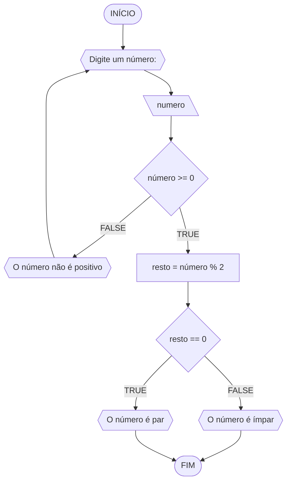
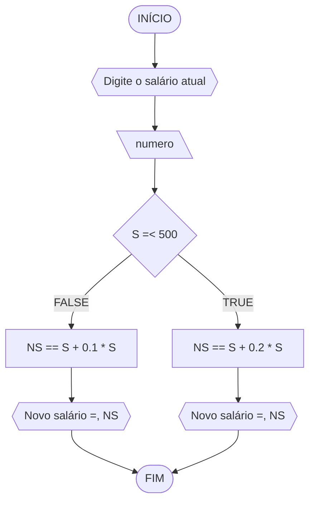

# UNIFOR
**Nome:** Lucas Carreiro

**Disciplina:** Raciocínio Lógico Algorítmico

## Lista de exercícios 01

### Exercício 01

#### Pseudocódigo
```
1 ALGORITMO verifica_par_ímpar
2 DECLARE numero, resto: INTEIRO
3 ESCREVA "Digite um número:"
4 INÍCIO
4 LEIA número
5 SE numero >= 0 ENTÃO
6   resto = numero % 2
7   SE resto == 0 ENTÃO
8     ESCREVA "O número é par"
9   SENAO
10    ESCREVA "O número é ímpar"
11   FIM_SE
12 SENAO
13   ESCREVA "Digite um número positivo"
14   FIM_SE
15 FIM
```
#### Fluxograma

#### Teste de mesa
```
| numero | numero >= 0 | resto | resto == 0 | Saída |
| -- | -- | -- | -- | -- |
| 7 | V | 1 | F | O número é ímpar |
| 18 | V | 0 | V | O número é par |
| -2 | F |  |  | O número não é positivo |
| 0 | V | 0 | V |O número é par |
```

### Exercício 02

#### Pseudocódigo
```
ALGORITMO
DECLARE S, NS NUMÉRICO
INÍCIO
ESCREVA “Digite o salário atual”
LEIA S
SE S ≤ 500
   NS ← S + 0.2 * S
   ESCREVA “Novo salário =”, NS
SENÃO
   NS ← S + 0.1 * S
   ESCREVA “Novo salário =”, NS
FIM_ALGORITMO
```
#### Fluxograma

#### Teste de mesa
```
| salário | S =< 500 | NS | Saída |
| 700 | F | 770 | Novo salário = 770 |
| 400 | V | 480 | Novo salário = 480 |

### Exercício 03

#### Pseudocódigo
```

