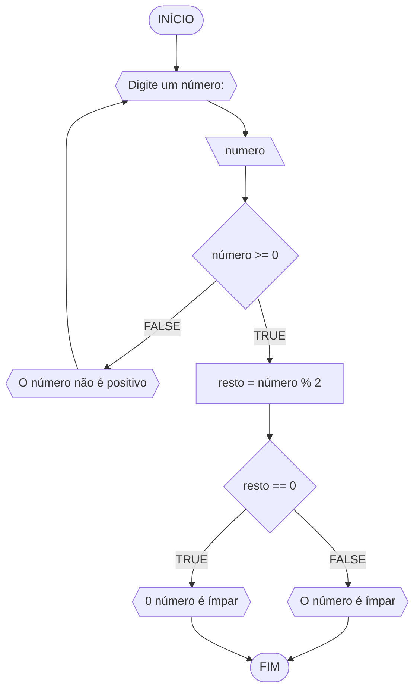

# UNIFOR
**Nome:** Lucas Carreiro

**Disciplina:** Raciocínio Lógico Algorítmico

## Lista de exercícios 01

### Exercício 01

#### Pseudocódigo
```
1 ALGORITMO verifica_par_ímpar
2 DECLARE numero, resto: INTEIRO
3 ESCREVA "Digite um número:"
4 INÍCIO
4 LEIA número
5 SE numero >= 0 ENTÃO
6   resto = numero % 2
7   SE resto == 0 ENTÃO
8     ESCREVA "O número é par"
9   SENAO
10    ESCREVA "O número é ímpar"
11   FIM_SE
12 SENAO
13   ESCREVA "Digite um número positivo"
14   FIM_SE
15 FIM
```
#### Fluxograma

