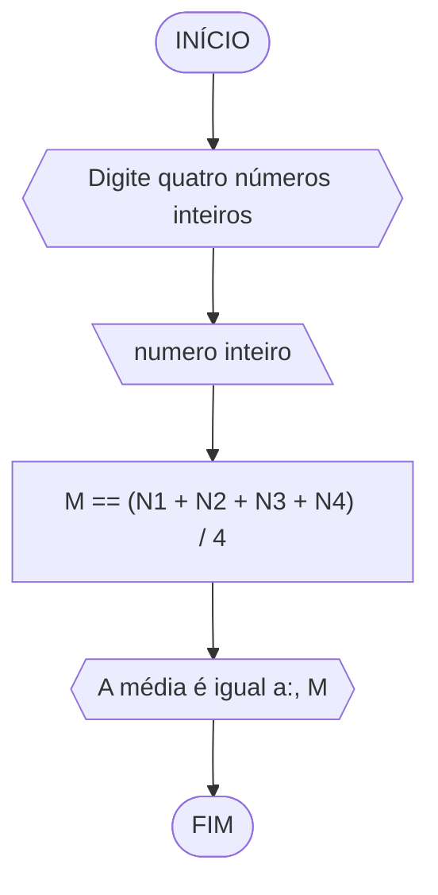
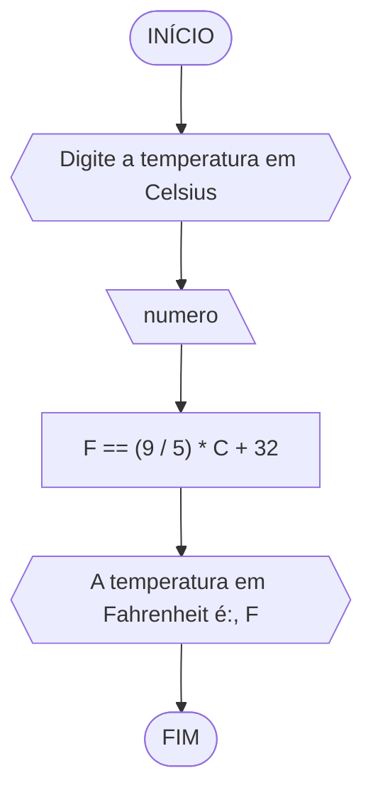

# UNIFOR
**Nome:** Lucas Carreiro Gomes

**Disciplina:** Raciocínio Lógico Algorítmico

## Lista de exercícios 02

### Exercício 01

#### Pseudocódigo
```
ALGORITMO
DECLARE N1, N2, N3, N4: inteiro
INÍCIO
ESCREVA “Digite quatro números inteiros”
LEIA N1, N2, N3, N4
M == (N1 + N2 + N3 + N4) / 4
ESCREVA “A média é igual a:”, M
FIM_ALGORITMO
```
#### Fluxograma

#### Teste de mesa
| N1 | N2 | N3 | N4 | M | Saída |
| -- | -- | -- | -- | -- | -- |
| 7 | 10 | 11 | 18 | 11,5 | A média é igual a: 11,5 |
| 0 | 0 | 0 | 0 | 0 | A média é igual a: 0 |
| -2 | -4 | -7 | -10 | -5,75 | A média é igual a: 5,75 |

### Exercício 02

#### Pseudocódigo
```
ALGORITMO
DECLARE C, F: real
INÍCIO
ESCREVA “Digite a temperatura em Celsius”
LEIA C
F == (9 / 5) * C + 32
ESCREVA “A temperatura em Fahrenheit é:”, F
FIM_ALGORITMO
```
#### Fluxograma

#### Teste de mesa
| C | F | Saída |
| -- | -- | -- |
| 25 | 77 | A temperatura em Fahrenheit é: 77 |
| 0 | 32 | A temperatura em Fahrenheit é: 32 |
| -10 | 14 | A temperatura em Fahrenheit é: 14 |

### Exercício 03

#### Pseudocódigo
```
