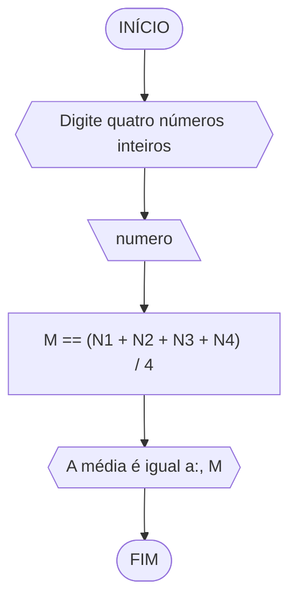
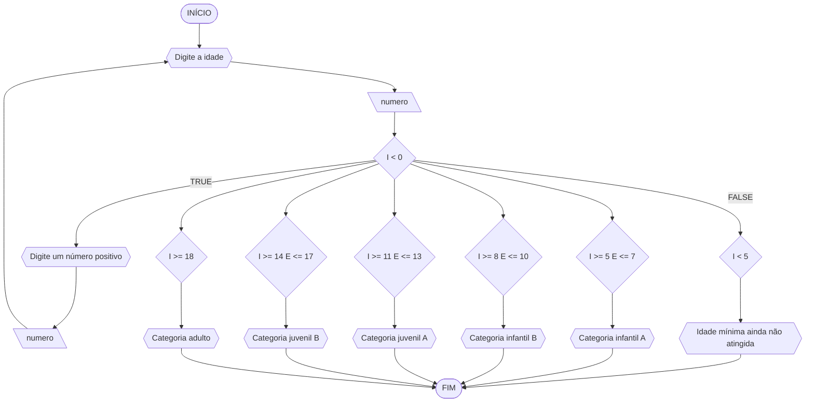

# UNIFOR
**Nome:** Lucas Carreiro Gomes

**Disciplina:** Raciocínio Lógico Algorítmico

## Lista de exercícios 02

### Exercício 01

#### Pseudocódigo
```
ALGORITMO
DECLARE N1, N2, N3, N4: inteiro
INÍCIO
ESCREVA “Digite quatro números inteiros”
LEIA N1, N2, N3, N4
M == (N1 + N2 + N3 + N4) / 4
ESCREVA “A média é igual a:”, M
FIM_ALGORITMO
```
#### Fluxograma

#### Teste de mesa
| N1 | N2 | N3 | N4 | M | Saída |
| -- | -- | -- | -- | -- | -- |
| 7 | 10 | 11 | 18 | 11,5 | A média é igual a: 11,5 |
| 0 | 0 | 0 | 0 | 0 | A média é igual a: 0 |
| -2 | -4 | -7 | -10 | -5,75 | A média é igual a: 5,75 |

### Exercício 02

#### Pseudocódigo
```
ALGORITMO
DECLARE C, F: real
INÍCIO
ESCREVA “Digite a temperatura em Celsius”
LEIA C
F == (9 / 5) * C + 32
ESCREVA “A temperatura em Fahrenheit é:”, F
FIM_ALGORITMO
```
#### Fluxograma

#### Teste de mesa
| C | F | Saída |
| -- | -- | -- |
| 25 | 77 | A temperatura em Fahrenheit é: 77 |
| 0 | 32 | A temperatura em Fahrenheit é: 32 |
| -10 | 14 | A temperatura em Fahrenheit é: 14 |

### Exercício 03

#### Pseudocódigo
```
ALGORITMO
DECLARE N1,N2: REAL, operador: CARACTERE
INÍCIO
ESCREVA "Digite dois números e um operador"
LEIA N1, N2, operador
ESCOLHA
   CASO operador == 'soma'
     S = N1 + N2
     ESCREVA "O resultado é:", S
   CASO operador == 'subtração'
     SUB = N1 - N2
     ESCREVA "O resultado é:", SUB
   CASO operador == 'multiplicação
     M = N1 * N2
     ESCREVA "O resultado é:", M
   CASO operador == "divisão"
     D = N1 / N2
       SE N2 = 0
         ESCREVA "É impossível dividir por 0"
       SENAO
         ESCREVA "O resultado é:", D
FIM_ESCOLHA
FIM_ALGORITMO
```
#### Fluxograma

#### Teste de mesa
| N1 | N2 | Operador | Resultado | Saída |
| -- | -- | -- | -- | -- |
| 14 | 7 | soma | 21 | O resultado é: 21 |
| 8 | 5 | subtração | 3 | O resultado é: 3 |
| 20 | 4 | multiplicação | 80 | O resultado é: 80 |
| 16 | 0 | divisão |  | É impossível dividir por 0 |
| 30 | 3 | divisão | 10 | O resultado é: 10 |

### Exercício 04

#### Pseudocódigo
```
ALGORITMO
DECLARE I: inteiro
INÍCIO
ESCREVA “Digite a idade”
LEIA I
ENQUANTO
   I < 0
   ESCREVA "Digite um número positivo"
FIM_ENQUANTO
ESCOLHA
   CASO I < 5
      ESCREVA "Idade mínima ainda não atingida"
   CASO I >= 5 E <= 7
      ESCREVA "Categoria infantil A"
   CASO I >= 8 E <= 10
      ESCREVA "Categoria infantil B"
   CASO I >= 11 E <= 13
      ESCREVA "Categoria juvenil A"
   CASO I >= 14 E <= 17
      ESCREVA "Categoria juvenil B"
   CASO I >= 18
      ESCREVA "Categoria adulto"
FIM_ESCOLHA
FIM_ALGORITMO
```
#### Fluxograma

#### Teste de mesa
| I | I < 0 | I < 5 | I >= 5 E <= 7 | I >= 8 E <= 10 | I >= 11 E <= 13 | I >= 14 E <= 17 | I >= 18 | Saída |
| -- | -- | -- | -- | -- | -- | -- | -- | -- |
| 4 | F | V | F | F | F | F | F | Idade mínima ainda não atingida |
| 7 | F | F | V | F | F | F | F | Categoria infantil A |
| 8 | F | F | F | V | F | F | F | Categoria infantil B |
| 12 | F | F | F | F | V | F | F | Categoria juvenil A |
| 15 | F | F | F | F | F | V | F | Categoria juvenil B |
| 19 | F | F | F | F | F | F | V | Categoria adulto |
| -7 | V |  |  |  |  |  |  | Digite um número positivo |
