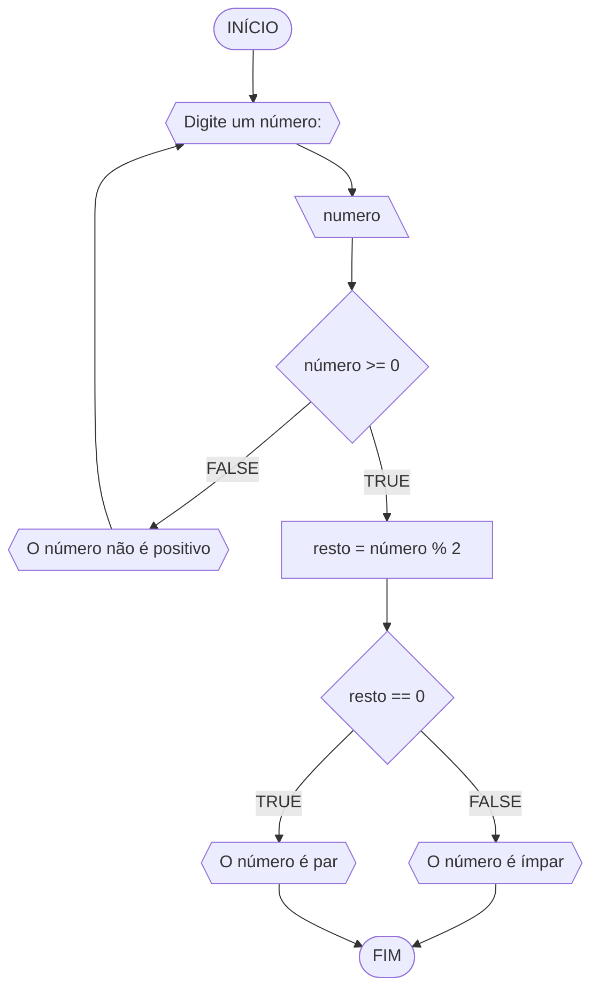
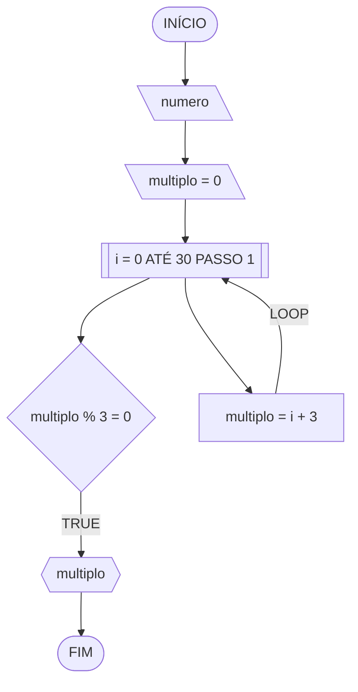
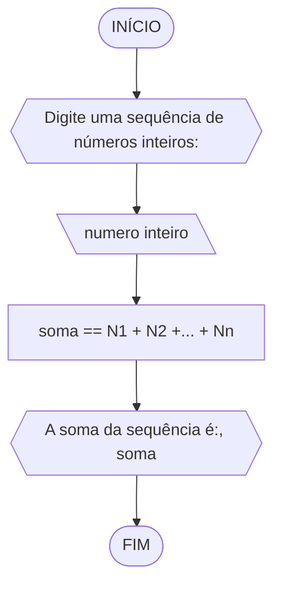
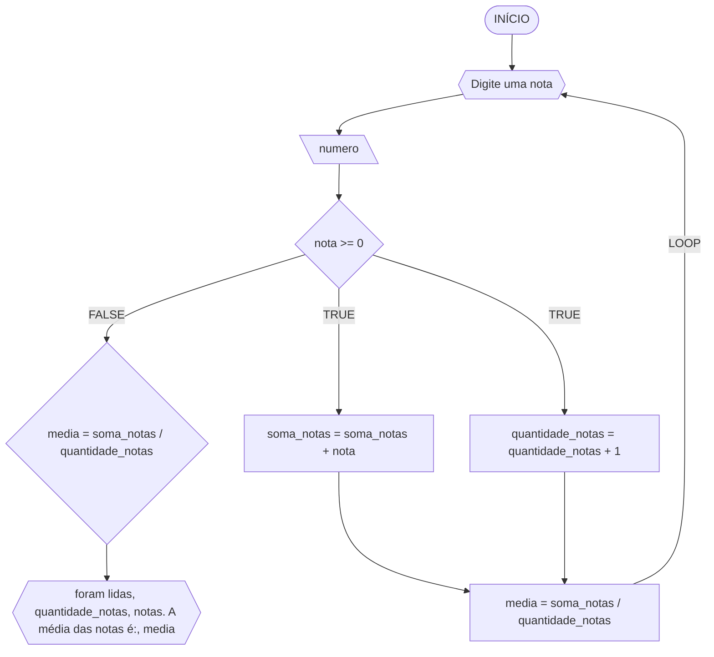

# UNIFOR
**Nome:** Lucas Carreiro Gomes

**Disciplina:** Raciocínio Lógico Algorítmico

## Lista de exercícios 03

### Exercício 01

#### Pseudocódigo
```
1 ALGORITMO verifica_par_ímpar
2 DECLARE numero, resto: INTEIRO
3 ESCREVA "Digite um número:"
4 INÍCIO
4 LEIA número
5 SE numero >= 0 ENTÃO
6   resto = numero % 2
7   SE resto == 0 ENTÃO
8     ESCREVA "O número é par"
9   SENAO
10    ESCREVA "O número é ímpar"
11   FIM_SE
12 SENAO
13   ESCREVA "Digite um número positivo"
14   FIM_SE
15 FIM
```
#### Fluxograma

#### Teste de mesa
| numero | numero >= 0 | resto | resto == 0 | Saída |
| -- | -- | -- | -- | -- |
| 7 | V | 1 | F | O número é ímpar |
| 18 | V | 0 | V | O número é par |
| -2 | F |  |  | O número não é positivo |
| 0 | V | 0 | V | O número é par |

### Exercício 02

#### Pseudocódigo
```
ALGORITMO
DECLARE i, soma: INTEIRO
INÍCIO
LEIA i
multiplo = 0
PARA i DE 0 ATÉ 30
  multiplo == i + i
  SE multiplo % 3 = 0
    ESCREVA multiplo
FIM_PARA
FIM_ALGORITMO
```
#### Fluxograma

#### Teste de mesa
| it | N | multiplo | multiplo % 3 = 0 | Saída |
| -- | -- | -- | -- | -- |
| 0 | 30 | 0 | V | 0 |
| 1 | 30 | 3 | V | 3 |
| 2 | 30 | 6 | V | 6 |
| 3 | 30 | 9 | V | 9 |
| 4 | 30 | 12 | V | 12 |
| 5 | 30 | 15 | V | 15 |
| 6 | 30 | 18 | V | 18 |
| 7 | 30 | 21 | V | 21 |
| 8 | 30 | 24 | V | 24 |
| 9 | 30 | 27 | V | 27 |
| 10 | 30 | 30 | V | 30 |

### Exercício 03

#### Pseudocódigo
```
ALGORITMO
DECLARE N1, N2,... Nn: INTEIRO
INÍCIO
ESCREVA "Digite uma sequência de números inteiros"
LEIA N1... Nn
soma == N1 + N2 +... + Nn
ESCREVA "A soma da sequência é:", soma
FIM_ALGORITMO
```
#### Fluxograma

#### Teste de mesa
| N1 | N2 | Nn | soma | Saída |
| -- | -- | -- | -- | -- |
| 4 | 11 | -2 | 13 | A soma da sequência é: 13 |
| 0 | -7 | 19 | 12 | A soma da sequência é: 12 |

### Exercício 04

#### Pseudocódigo
```
ALGORITMO
DECLARE notas, soma_notas, media: real, quantidade_notas: inteiro
INÍCIO
soma_notas = 0
quantidade_notas = 0
ESCREVA "Digite uma nota"
ENQUANTO
  nota >= 0
    REPITA
    soma_notas == soma_notas + nota
    quantidade_notas == quantidade_notas + 1
    media == soma_notas / quantidade_notas
    ESCREVA "Digite uma nota"
FIM_ENQUANTO
SE nota < 0
  media == soma_notas / quantidade_notas
  ESCREVA "foram lidas", quantidade_notas, "notas. A média das notas é":, media
FIM_ALGORITMO
```
#### Fluxograma

#### Teste de mesa
| nota | nota >= 0 | soma_notas | quantidade_notas | media | Saída |
| -- | -- | -- | -- | -- | -- |
| 8 | V | 8 | 1 | 8 |  |
| 10 | V | 18 | 2 | 9 |  |
| 6 | V | 24 | 3 | 8 |  |
| 9 | V | 33 | 4 | 8,25 |  |
| -7 | F |  |  |  | Foram lidas 4 notas. A média aritmética é 8,25 |
