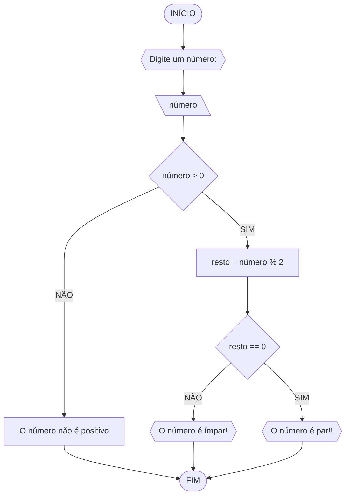

# UNIFOR
**Nome:** Lucas Carreiro

**Disciplina**: Raciocínio Lógico Algorítmico

## Exercício 03
### Fluxograma

### Pseudocódigo
```
1 ALGORITMO verifica_par_ímpar
2 DECLARE número, resto: INTEIRO
3 ESCREVA "Digite um número:"
INÍCIO
4 LEIA número
5 SE número > 0 ENTÃO
6		resto = número % 2
7		SE resto = 0 ENTÃO
8			ESCREVA "O número é par!"
9		SENÃO
10			ESCREVA "O número é ímpar!"
11 SENÃO 
12		ESCREVA "O número não é positivo!"
13 FIM_ALGORITMO
```
